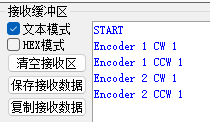
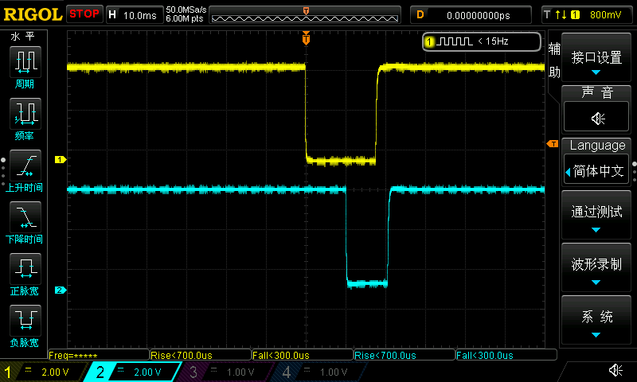
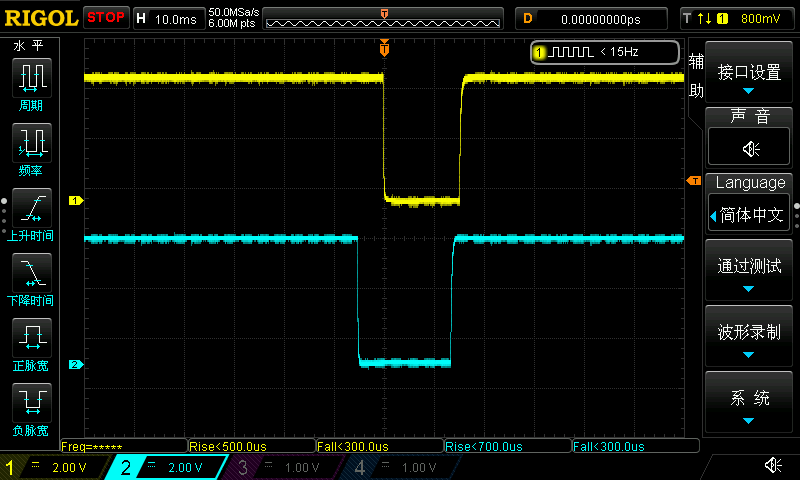
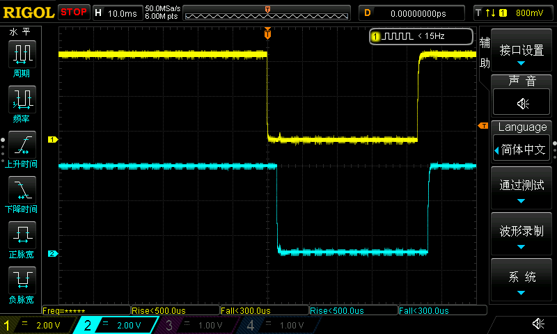
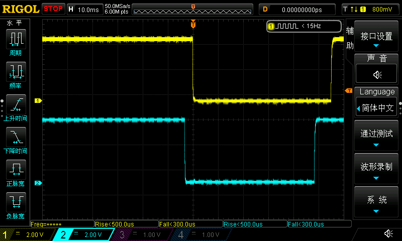

# Rotary_Encoder

EC11 多旋转编码器库，在 51 平台测试通过。

## 特性

- 支持 1C1P & 2C1P 模式的编码器
- 采用链表管理编码器实例，支持多编码器操作
- 可为编码器分配不同 id，重用一个编码器事件回调函数

## 仓库目录说明

- `Example` 目录存放了库的示例
- `images` 目录存放了本文档中使用的图片
- `Lib` 目录中存放了旋转编码器库的源文件

## 使用方式

1. 将 Lib 文件夹下的 `encoder.c` 以及 `encoder.h` 分别添加到编译以及包含列表中；
2. 在程序中使用 `Encoder` 类型声明一个编码器对象；
3. 实现编码器的信号读取函数（`Encoder_Signal_Read` 类型）以及事件回调函数（`Encoder_Rotate_Callback` 类型）；
4. 使用 `Encoder_Init` 函数对编码器对象进行初始化；
5. 在编码器的 A 信号中断函数中调用 `Encoder_A_Dual_Edge_Interrupt` 函数；
6. 在主循环中调用 `Encoder_Poll` 函数对编码器事件进行处理。

## 编码器信号示例

### 1C1P（1 定位 1 脉冲编码器）

1 定位 1 脉冲编码器顺时针旋转一格

1 定位 1 脉冲编码器逆时针旋转一格

### 2C1P（2 定位 1 脉冲编码器）

1 定位 1 脉冲编码器顺时针旋转两格

1 定位 1 脉冲编码器逆时针旋转两格

